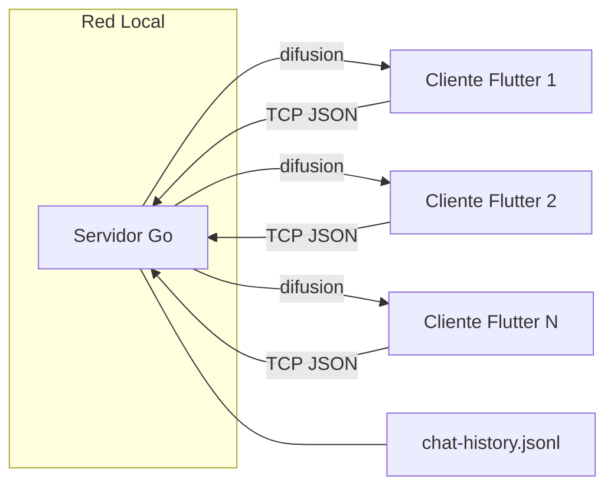
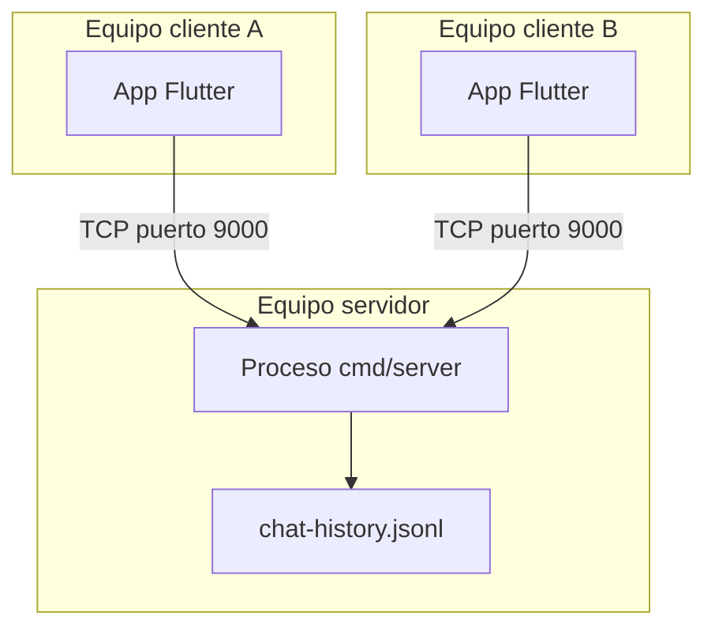

# Arquitectura Propuesta

## 1. Vista general

El sistema sigue una arquitectura **cliente-servidor** con un único punto
central (el servidor) y múltiples clientes conectados por red local
mediante TCP.



- El servidor es el único que escribe y lee el archivo de historial.
- Todos los clientes se comunican exclusivamente con el servidor; no existe
  comunicación directa entre clientes.
- La difusión (broadcast) es responsabilidad exclusiva del servidor.

## 2. Componentes

### 2.1 Servidor (Go)

| Elemento | Archivo | Responsabilidad |
|---|---|---|
| `main` | [`cmd/server/main.go`](../cmd/server/main.go) | Lee banderas de configuración, crea el servidor, abre el listener TCP y acepta conexiones. |
| `chat.Server` | [`internal/chat/server.go`](../internal/chat/server.go) | Mantiene el historial en memoria, la lista de clientes conectados y el archivo de persistencia. |
| `chat.client` | [`internal/chat/server.go`](../internal/chat/server.go) | Representa una conexión TCP individual y el usuario asociado a ella. |

El servidor usa una goroutine por cada conexión aceptada
(`go server.ServeConn(conn)`), lo que permite atender múltiples clientes en
paralelo sin bloquear el bucle principal de aceptación.

El detalle llamada por llamada está documentado en
[`docs/server-callgraph.md`](../docs/server-callgraph.md).

### 2.2 Cliente (Flutter)

| Elemento | Archivo | Responsabilidad |
|---|---|---|
| `ChatApp` | [`client/lib/main.dart`](../client/lib/main.dart) | Widget raíz de la aplicación. |
| `ConnectScreen` | [`client/lib/main.dart`](../client/lib/main.dart) | Captura IP, puerto y usuario; abre el `Socket` TCP. |
| `ChatScreen` | [`client/lib/main.dart`](../client/lib/main.dart) | Escucha el socket, decodifica eventos JSON y muestra la conversación; permite enviar mensajes. |

El detalle llamada por llamada está documentado en
[`docs/client-callgraph.md`](../docs/client-callgraph.md).

## 3. Modelo de datos

### `Request` (cliente → servidor)

```go
type Request struct {
    Type string // "join" o "message"
    User string
    Text string // solo para "message"
}
```

### `Event` (servidor → cliente)

```go
type Event struct {
    Type string // "message" o "error"
    ID   uint64
    User string
    Text string
    Time time.Time
}
```

### Persistencia

Cada `Event` de tipo `message` se serializa como una línea JSON y se agrega
al final del archivo `chat-history.jsonl` (formato JSON Lines). Al iniciar,
el servidor relee este archivo completo para reconstruir el historial en
memoria (`Server.history`) y calcular el siguiente ID disponible.

## 4. Concurrencia y sincronización

- `Server.mu` (`sync.Mutex`): protege `history`, `clients` y `nextID`. Se
  usa en `register`, `unregister` y `publish`.
- `client.mu` (`sync.Mutex`): evita que dos goroutines escriban al mismo
  tiempo sobre la misma conexión TCP (por ejemplo, un broadcast y un envío
  de error simultáneos).

Esto convierte al servidor en **thread-safe** respecto a su estado
compartido, siguiendo el modelo de concurrencia estándar de Go
(goroutines + mutex), apropiado para un sistema embebido Linux donde se
espera manejar varias conexiones simultáneas con recursos limitados.

## 5. Topología de despliegue



- El servidor escucha en un único puerto TCP configurable (por defecto
  `9000`, bandera `-addr`).
- El historial se asocia a una única instancia de servidor; no hay
  replicación ni sincronización entre varios servidores.
- Todos los equipos deben estar en la misma red local (o tener el puerto
  accesible mediante reenvío de puertos), ya que no existe un mecanismo de
  descubrimiento automático del servidor.

## 6. Decisiones de diseño y justificación

| Decisión | Justificación |
|---|---|
| Protocolo JSON por línea sobre TCP crudo | Simplicidad de implementación y depuración (se puede probar con `nc`), sin depender de bibliotecas externas. |
| Persistencia en archivo `.jsonl` en vez de base de datos | Reduce dependencias externas, adecuado para un entorno embebido/local sencillo. |
| Una goroutine por conexión | Modelo de concurrencia nativo de Go, simple y eficiente para la cantidad de clientes esperada en una red local. |
| Reenvío del historial antes de registrar al cliente | Evita condiciones de carrera donde un cliente nuevo reciba un mensaje de difusión antes que el historial, lo que generaría orden inconsistente. |

## 7. Limitaciones conocidas de la arquitectura actual

- Es un **punto único de falla**: si el proceso del servidor se detiene,
  se interrumpe todo el chat (aunque el historial persiste en disco).
- No hay balanceo de carga ni múltiples instancias del servidor.
- El archivo de historial crece de forma indefinida; no hay rotación ni
  límite de tamaño implementado.
- No hay cifrado de transporte (TLS) ni autenticación de usuarios.

## 8. Información pendiente por parte del equipo

Para completar esta sección falta que el equipo indique:

1. Si la arquitectura debe evolucionar a algo distinto (por ejemplo,
   WebSockets en vez de TCP crudo, para dar soporte web), ya que el cliente
   actual usa `dart:io Socket`, que no funciona en navegadores.
2. Requisitos de la red local real donde se desplegará (por ejemplo, un
   laboratorio con Raspberry Pi u otro dispositivo embebido actuando como
   servidor), para documentar la topología de despliegue real del curso.
3. Si se requiere un diagrama de arquitectura adicional en una herramienta
   específica pedida por el docente (por ejemplo, UML en una herramienta
   particular), distinto al diagrama Mermaid aquí incluido.
