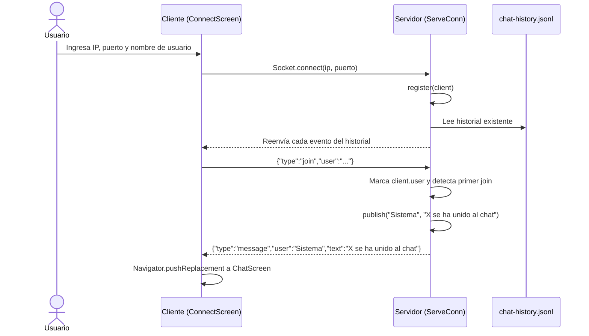
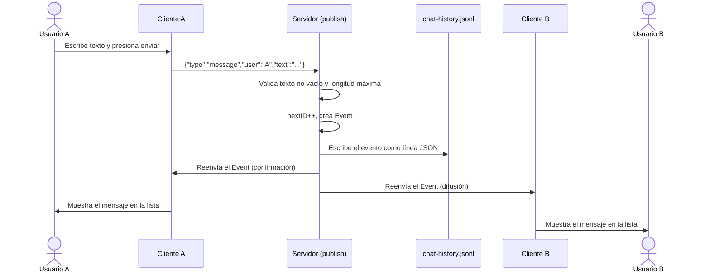
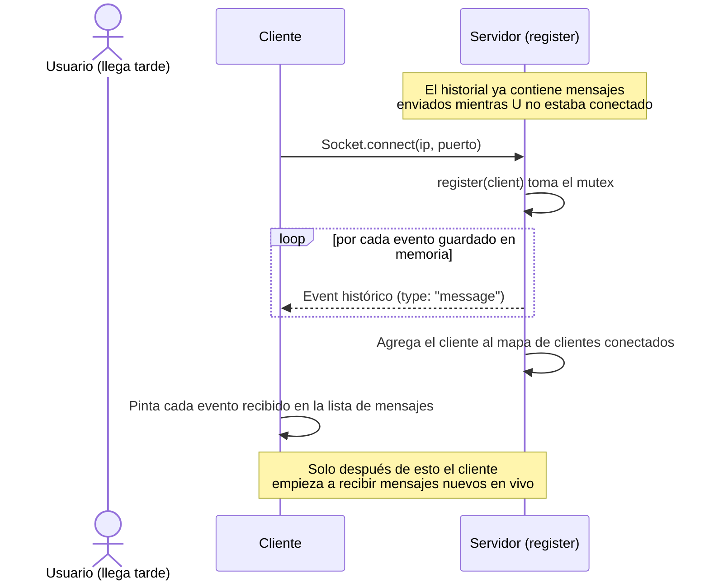
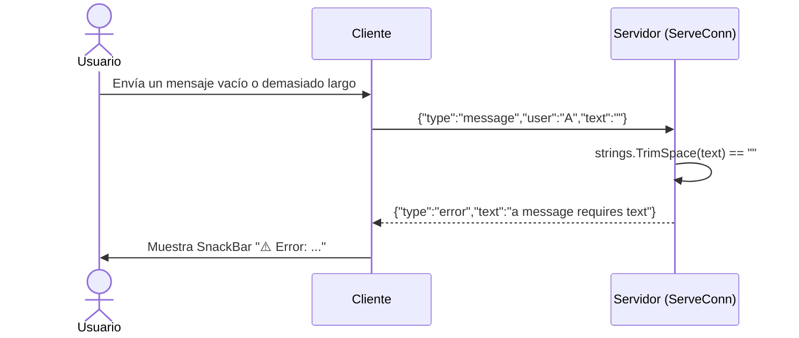
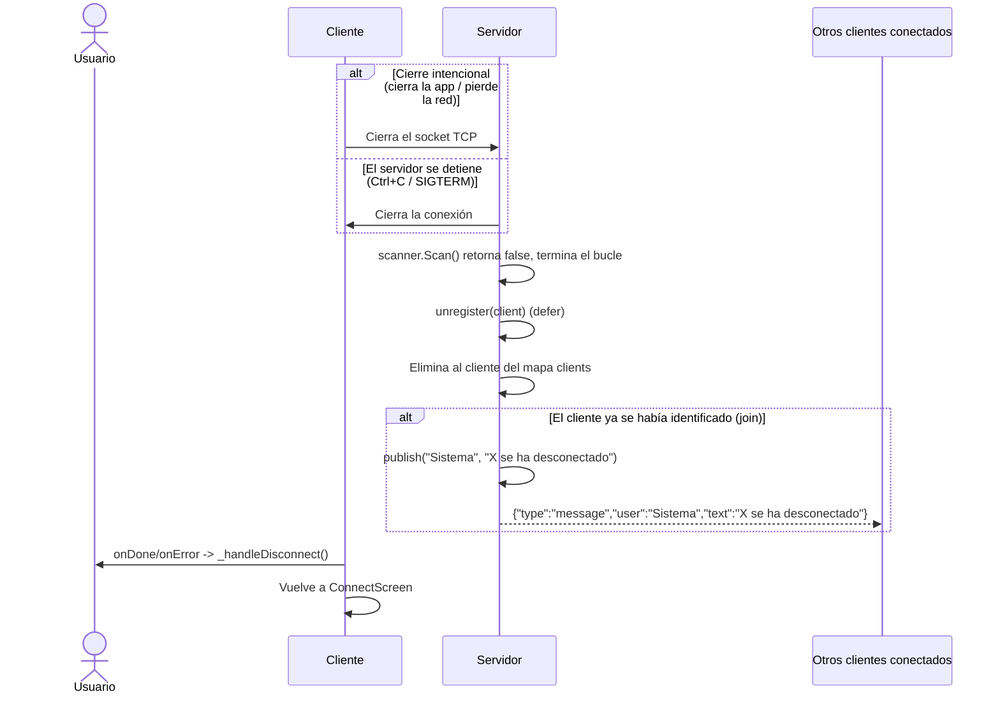

# Diagramas de Interacción

Este documento complementa a [`03-Arquitectura.md`](03-Arquitectura.md) con
**diagramas de secuencia** (diagramas de interacción) que muestran, paso a
paso, cómo se comunican el **Cliente (Flutter)** y el **Servidor (Go)** para
cada operación principal del chat. Cada diagrama está acompañado de una
referencia al código fuente donde ocurre cada paso.

## 1. Conexión e identificación de un usuario (`join`)

Código relacionado: `_connect` en
[`client/lib/main.dart`](../client/lib/main.dart), y
`Server.register`/`Server.ServeConn` (caso `"join"`) en
[`internal/chat/server.go`](../internal/chat/server.go).

## 2. Envío de un mensaje y difusión (broadcast)

Código relacionado: `_sendMessage` en
[`client/lib/main.dart`](../client/lib/main.dart), y `Server.publish` en
[`internal/chat/server.go`](../internal/chat/server.go).

## 3. Reenvío de historial a un cliente que se conecta tarde

Código relacionado: `Server.register` en
[`internal/chat/server.go`](../internal/chat/server.go) (el historial se
envía **antes** de agregar el cliente al mapa `clients`, para evitar que se
pierda o se duplique algún mensaje concurrente).

## 4. Manejo de una solicitud inválida

Este mismo patrón aplica para JSON mal formado, usuario vacío, texto que
excede `maxMessageLength` y tipos de solicitud desconocidos. En todos los
casos el servidor responde con un evento `"error"` y continúa esperando la
siguiente línea (no cierra la conexión).

Código relacionado: bloque `switch request.Type` dentro de
`Server.ServeConn` en [`internal/chat/server.go`](../internal/chat/server.go),
y el manejo de `event.type == 'error'` en `_listenSocket` de
[`client/lib/main.dart`](../client/lib/main.dart).

## 5. Desconexión de un usuario

Código relacionado: `defer s.unregister(client)` en `Server.ServeConn` y
`Server.unregister` en [`internal/chat/server.go`](../internal/chat/server.go),
y `onDone`/`onError`/`_handleDisconnect` en
[`client/lib/main.dart`](../client/lib/main.dart).

## 6. Relación con los demás diagramas del proyecto

- Los **callgraphs** ([`docs/server-callgraph.md`](../docs/server-callgraph.md)
  y [`docs/client-callgraph.md`](../docs/client-callgraph.md)) muestran qué
  función llama a qué función **dentro** de cada componente.
- Los diagramas de este documento muestran, en cambio, el **intercambio de
  mensajes entre el cliente y el servidor a través de la red**, es decir, la
  interacción observable desde afuera del proceso.
- El diagrama de topología de despliegue en
  [`03-Arquitectura.md`](03-Arquitectura.md) complementa esta vista
  mostrando dónde corre cada componente físicamente.

## 7. Información pendiente por parte del equipo

1. Confirmar si se requiere un diagrama de interacción adicional para algún
   caso de uso específico pedido por el docente que no esté cubierto aquí.
