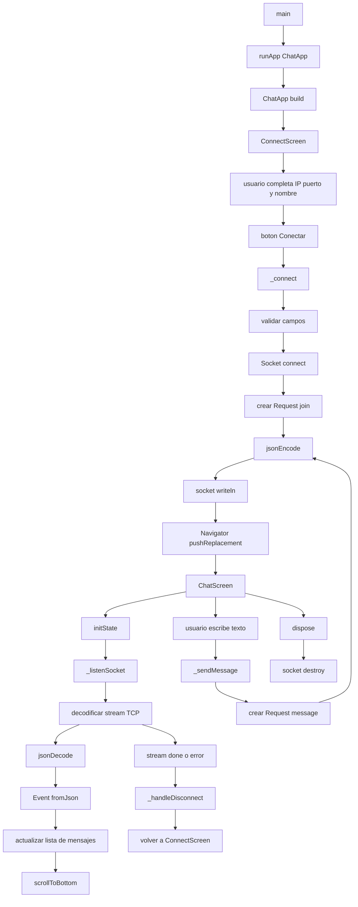

# Callgraph del cliente Flutter

Este documento describe las llamadas principales del cliente Flutter en
[`client/lib/main.dart`](../client/lib/main.dart).

## 1. Vista general



## 2. Arranque de la aplicación

```text
main
└── runApp(const ChatApp())
    └── ChatApp.build
        └── MaterialApp
            └── ConnectScreen
```

1. `main` es el punto de entrada de Dart.
2. `runApp` monta el widget raíz `ChatApp`.
3. `ChatApp.build` configura el tema y la pantalla inicial.
4. La pantalla inicial es `ConnectScreen`, donde el usuario indica cómo
   conectarse al servidor.

## 3. Modelos de comunicación

### `Request`

`Request` representa una solicitud que el cliente envía al servidor.

```text
Request
├── type
├── user
└── text opcional
    └── toJson
        └── Map<String, dynamic>
            └── jsonEncode
```

El cliente utiliza dos tipos:

```json
{"type":"join","user":"ana"}
```

```json
{"type":"message","user":"ana","text":"Hola"}
```

### `Event`

`Event` representa información recibida desde el servidor:

```text
jsonDecode
└── Event.fromJson
    ├── type
    ├── id
    ├── user
    ├── text
    └── time
        └── DateTime.parse(...).toLocal()
```

Los eventos pueden ser mensajes del chat o respuestas de error.

## 4. Flujo de conexión

```text
ConnectScreen
└── _ConnectScreenState._connect
    ├── lee IP
    ├── lee puerto
    ├── lee usuario
    ├── valida campos
    ├── activa _isLoading
    ├── Socket.connect
    │   ├── éxito
    │   │   ├── crea Request join
    │   │   ├── Request.toJson
    │   │   ├── jsonEncode
    │   │   ├── socket.writeln
    │   │   └── Navigator.pushReplacement
    │   │       └── ChatScreen
    │   └── error
    │       └── SnackBar con error de conexión
    └── finally desactiva _isLoading
```

La conexión tiene un tiempo máximo de espera de cinco segundos. Si falla, el
usuario permanece en `ConnectScreen` y recibe una notificación visual.

## 5. Recepción de historial y mensajes

Cuando se crea `ChatScreen`, su método `initState` llama a `_listenSocket`.

```text
ChatScreen.initState
└── _listenSocket
    └── widget.socket
        ├── cast<List<int>>
        ├── utf8.decoder
        ├── LineSplitter
        └── listen
            ├── cada línea
            │   ├── ignora líneas vacías
            │   ├── jsonDecode
            │   ├── Event.fromJson
            │   ├── si type = message
            │   │   ├── _messages.add
            │   │   └── _scrollToBottom
            │   └── si type = error
            │       └── SnackBar
            ├── onDone
            │   └── _handleDisconnect
            └── onError
                └── _handleDisconnect
```

El servidor envía cada evento como una línea JSON. `LineSplitter` permite
procesar cada evento por separado, incluso cuando varios eventos llegan por
la misma conexión TCP.

El historial se recibe por este mismo flujo: para el cliente no hay una ruta
especial, porque el servidor lo envía como eventos `message` inmediatamente
después de conectarse.

## 6. Envío de mensajes

```text
botón enviar o Enter
└── _sendMessage
    ├── lee _msgController.text
    ├── elimina espacios externos
    ├── ignora texto vacío
    ├── crea Request message
    ├── Request.toJson
    ├── jsonEncode
    ├── socket.writeln
    └── limpia _msgController
```

La interfaz no guarda el mensaje directamente en la lista. Espera la
confirmación del servidor mediante el evento recibido por `_listenSocket`.
Esto permite que todos los clientes, incluido el remitente, reciban la misma
representación del mensaje creada por el servidor.

## 7. Renderizado de mensajes

```text
ChatScreen.build
└── ListView.builder
    └── por cada Event
        ├── user = Sistema
        │   └── muestra aviso centrado
        ├── user = usuario actual
        │   └── muestra burbuja alineada a la derecha
        └── otro usuario
            └── muestra burbuja alineada a la izquierda
```

`_formatDate` convierte la fecha del evento en formato
`dd/mm/yyyy hh:mm:ss`. `_scrollToBottom` espera al siguiente ciclo de
renderizado antes de desplazar la lista para que el nuevo mensaje quede
visible.

## 8. Desconexión y ciclo de vida

```text
Socket stream
├── onDone
└── onError
    └── _handleDisconnect
        ├── muestra SnackBar
        └── vuelve a ConnectScreen

ChatScreen.dispose
├── socket.destroy
├── _msgController.dispose
└── _scrollController.dispose
```

`dispose` libera la conexión TCP y los controladores de Flutter para evitar
recursos abiertos cuando la pantalla deja de existir.

## 9. Resumen para exposición

> El cliente inicia en `main`, monta `ChatApp` y muestra `ConnectScreen`.
> Cuando el usuario introduce la IP, el puerto y su nombre, `_connect` abre
> un socket TCP y envía una solicitud `join`. Después navega a `ChatScreen`,
> que escucha el socket, separa cada línea JSON, crea objetos `Event` y
> actualiza la lista visual. Para enviar mensajes, `_sendMessage` serializa
> un `Request` y lo escribe en el socket. Los eventos del historial y los
> mensajes nuevos siguen el mismo flujo de recepción. Si el socket termina o
> falla, `_handleDisconnect` devuelve al usuario a la pantalla de conexión.
