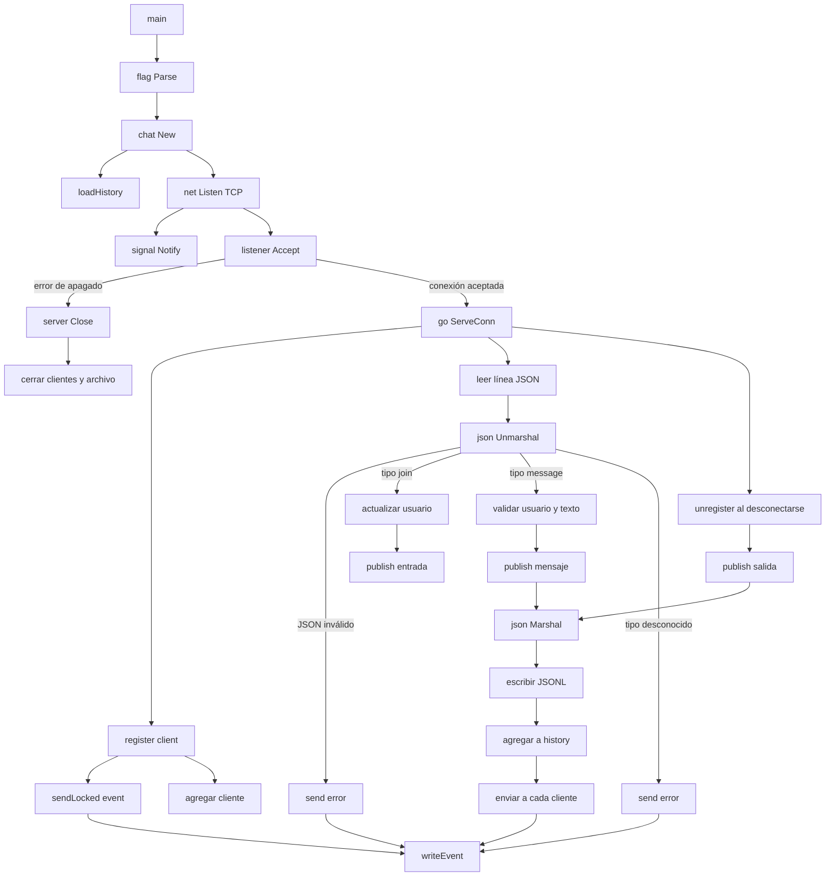

# Callgraph del servidor

Este documento describe las llamadas principales del servidor TCP implementado
en [`cmd/server/main.go`](../cmd/server/main.go) y
[`internal/chat/server.go`](../internal/chat/server.go).

## 1. Vista general



## 2. Arranque del proceso

```text
main
├── flag.Parse
├── chat.New
│   └── Server.loadHistory
├── net.Listen
├── signal.Notify
└── bucle de aceptación
    ├── listener.Accept
    └── go Server.ServeConn
```

1. `main` lee la dirección TCP y la ruta del historial.
2. `chat.New` abre o crea el archivo JSONL.
3. `loadHistory` lee cada línea, reconstruye `history` y recupera `nextID`.
4. `net.Listen` crea el listener TCP.
5. `Accept` espera clientes.
6. Cada cliente se entrega a una goroutine independiente mediante
   `go server.ServeConn(conn)`.

## 3. Conexión de un cliente

```text
Server.ServeConn
├── crea client
├── register
│   ├── recorre Server.history
│   ├── sendLocked
│   │   └── writeEvent
│   └── agrega client a Server.clients
├── scanner.Scan
│   ├── json.Unmarshal
│   ├── procesa join o message
│   └── continúa hasta desconexión
└── unregister
    ├── elimina client de Server.clients
    └── publish("Sistema", "usuario se ha desconectado")
```

El orden es importante: el historial se envía antes de insertar el cliente en
`Server.clients`. Así, el cliente recibe primero los mensajes anteriores y
después queda listo para recibir nuevas difusiones.

## 4. Solicitud `join`

El cliente puede identificarse enviando:

```json
{"type":"join","user":"ana"}
```

La ruta de llamadas es:

```text
ServeConn
└── case "join"
    ├── guarda client.user
    └── si es la primera identificación:
        └── publish("Sistema", "ana se ha unido al chat")
            ├── incrementa nextID
            ├── crea Event
            ├── json.Marshal
            ├── file.Write
            ├── agrega a history
            └── sendLocked para cada cliente conectado
                └── writeEvent
```

El evento de entrada se trata como un mensaje normal, por lo que queda
persistentemente en el historial.

## 5. Solicitud `message`

El cliente envía:

```json
{"type":"message","user":"ana","text":"Hola"}
```

La ruta de llamadas es:

```text
ServeConn
└── case "message"
    ├── recorta espacios de text
    ├── valida que text no esté vacío
    ├── valida maxMessageLength
    ├── asigna client.user si todavía no existe
    └── publish(user, text)
        ├── incrementa nextID
        ├── crea Event con fecha y hora local
        ├── json.Marshal
        ├── file.Write(... + "\\n")
        ├── agrega el evento a history
        └── difunde a cada cliente
            └── sendLocked
                └── writeEvent
```

## 6. Errores de protocolo

```text
ServeConn
├── JSON inválido
│   └── send(Event{Type: "error"})
├── user vacío
│   └── send(Event{Type: "error"})
├── text vacío
│   └── send(Event{Type: "error"})
├── text demasiado largo
│   └── send(Event{Type: "error"})
└── type desconocido
    └── send(Event{Type: "error"})

send
└── writeEvent
    └── json.NewEncoder.Encode
```

Los errores se envían al cliente que hizo la solicitud y no se agregan al
historial, porque solamente `publish` persiste eventos de tipo `message`.

## 7. Persistencia y difusión

`publish` es el centro del flujo de mensajes:

```text
publish
├── bloquea Server.mu
├── incrementa Server.nextID
├── construye Event
├── serializa Event a JSON
├── agrega una línea a chat-history.jsonl
├── agrega Event a Server.history
└── recorre Server.clients
    ├── sendLocked
    │   └── writeEvent
    └── si falla:
        ├── cierra conexión
        └── elimina cliente
```

La escritura en el archivo ocurre antes de la difusión. Por tanto, cuando un
cliente recibe un evento, ese evento ya fue agregado al historial en memoria y
al archivo.

## 8. Sincronización

Hay dos mutexes:

- `Server.mu`: protege `history`, `clients` y `nextID`.
- `client.mu`: evita que dos goroutines escriban simultáneamente en la misma
  conexión TCP.

`sendLocked` significa que el mutex del cliente se toma dentro de una operación
que ya mantiene `Server.mu`; no es una función sin bloqueo, sino una variante
con un nombre que indica el contexto de uso.

## 9. Apagado

```text
SIGINT/SIGTERM
├── se cierra listener
├── Accept devuelve error
├── main sale del bucle
├── defer listener.Close
└── defer server.Close
    ├── cierra conexiones de clientes
    └── cierra archivo de historial
```

## 10. Resumen para exposición

> `main` inicializa el servidor y espera conexiones TCP. Cada conexión se
> atiende en una goroutine mediante `ServeConn`. Al conectarse, `register`
> envía el historial. Cada línea JSON se valida y se procesa como `join` o
> `message`. Los mensajes pasan por `publish`, que les asigna un ID, los guarda
> en JSONL y los difunde a todos los clientes. Cuando una conexión termina,
> `unregister` la elimina y publica el aviso de desconexión. Los mutexes
> protegen el estado compartido y las escrituras concurrentes.
